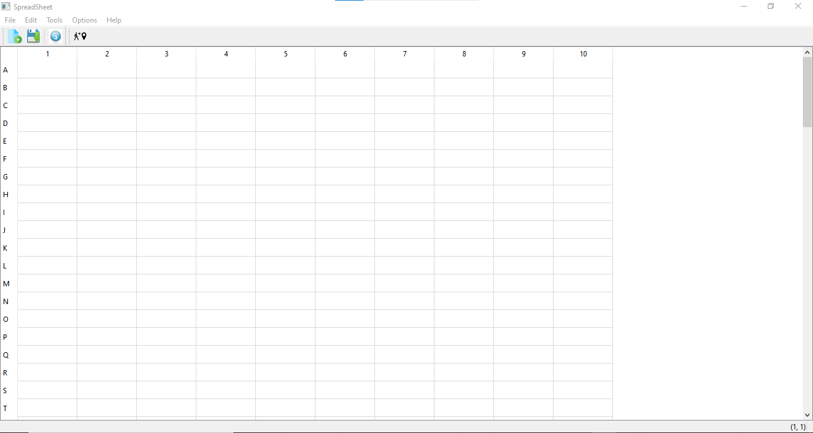

<h1 align="center">SpreedSheet and Texy Editor application </h1> 

<h1 align="center"> Homework3:MainApplication-SpreedSheet </h1>
 <p align="center"> <br> SpreedSheet</p> 

## Objective:
The goal of this exercice is to create a Application Using Main Window that's mean create a MainWindow based application using the designer.
IN this application we will create 5 menubar and each one has also at least a submenubar.
This repport we will contain :
1. A detailed description on the connexions made for the spreadSheet.
2. The code and details about the Load action.
3. Add the code for the following actions:
* Select Row
* Select Col
* Delete cell content.
4. Add the code for reading a Csv file in your spreadsheet
5. Add the actions to show the most five recent files.
6. Share your experience in creating the second application using the designer.

## Introduction 
* SpreadShett is an electronic document in which data is arranged in the rows and columns of a grid and can be manipulated and used in calculations.
* The definition of a spreadsheet is a piece of paper or a computer program used for accounting and recording data using rows and columns into which information can be entered. Microsoft Excel, a program in which you enter data into columns, is an example of a spreadsheet program.
* In this  homework we will create our spreedsheet withoot using desiner and a second application using designer .

# A detailed description on the connexions:
<h3 align="center">Description:</h3>
<p>we are creating a simple application called spreedsheet,is based on QTablewidgets,this application allows users to fill in the table and applied multiple functionlities.<br>Our applicartion contain a menu bar,toolbar,statusbar...<br>Any user can save,open the file copy and delete a content cell,you can also search a content using the functionality find and a lot of things that i let you to discover it yourself.<br>We are creating the menus and the actions and we are impemented the connection and all neccerray programming to make the application works.<br>Concerning the detailed about our code you will find the description on the comments.
</p>

<details>
<summary>Implimentation of SpreedSheet.h</summary>
<br>
  we are addeed the cut copy paste functionalities in our application.
<p> </p>
 
``` 
#ifndef SPREADSHEET_H
#define SPREADSHEET_H

#include <QMainWindow>
#include <QTableWidget>
#include <QAction>
#include <QMenu>
#include <QToolBar>
#include <QLabel>
#include <QStatusBar>
#include<QFile>
#include<QLineEdit> 
#include<QTextStream>
class SpreadSheet : public QMainWindow
{
    Q_OBJECT

public:
    SpreadSheet(QWidget *parent = nullptr);
    ~SpreadSheet();

protected:
    void setupMainWidget();
    void createActions();
    void createMenus();
    void createToolBars();
    void makeConnexions();
    void saveContent(QString filename)const; //method to save a file

    //--------slots----------//
private slots:
    void close();
    void updateStatusBar(int, int); // mise a jour de la status bar lors de selection de cell
    void saveSlot();                //Slot to save the content of the file
    void aboutSlot();               //slot to display a message information about the  application
    void aboutQTSlot();             //lot to display a message about the QT
    void paste_slot();                //slot to paste a content 
    void copy_slot();               //slot to copy a content  
    void cut_slot();               //slot to cut a content  

 //----------Pointers-------------//
private:
    // main widget
    QTableWidget *spreadsheet;
    //acitons
    QAction * newFile;
    QAction * open;
    QAction * save;
    QAction * saveAs;
    QAction * exit;
    QAction *cut;
    QAction *copy;
    QAction *paste;
    QAction *deleteAction;
    QAction *find;
    QAction *row;
    QAction *Column;
    QAction *all;
    QAction *goCell;
    QAction *recalculate;
    QAction *sort;
    QAction *showGrid;
    QAction *auto_recalculate;
    QAction *about;
    QAction *aboutQt;
    QAction *showgrid;

    // menus
    QMenu *FileMenu;
    QMenu *editMenu;
    QMenu *toolsMenu;
    QMenu *optionsMenu;
    QMenu *helpMenu;
    //un pointeur sur le nom de fichier
    QString *currentFile;
    //  ----- - Widget pour la bare d'etat
    QLabel *cellLocation;  //position de la cellule active
    QLabel *cellFormula;   // Formuel de la cellue active

};

#endif // SPREADSHEET_H
```
</details>

<details>
<summary>Implimentation of SpreedSheet.cpp</summary>
<br>

 
```
#include "spreadsheet.h"
#include "godialog.h"
#include <QPixmap>
#include <QMenuBar>
#include <QToolBar>
#include <QApplication>
#include <QMessageBox>
#include "find.h"
#include<QFileDialog>
#include<QMimeData>
#include<QClipboard>
#include<QDebug>
SpreadSheet::SpreadSheet(QWidget *parent)
   : QMainWindow(parent)
{
   //Seting the spreadsheet

   setupMainWidget();

   // Creaeting Actions
   createActions();

   // Creating Menus
   createMenus();


   //Creating the tool bar
   createToolBars();

   //making the connexions
   makeConnexions();

   //Creating the labels for the status bar (should be in its proper function)
   cellLocation = new QLabel("(1, 1)");
   cellFormula = new QLabel("");
   statusBar()->addPermanentWidget(cellLocation);
   statusBar()->addPermanentWidget(cellFormula);

   QStringList labels;

   for(char letter = 'A';letter <='Z';letter++){
       labels << QString(letter);
   }
   spreadsheet->setVerticalHeaderLabels(labels);
   //traitement  de nom de fichier
   currentFile=nullptr;
   //changer le titre
   setWindowTitle("SpreadSheet");
}

void SpreadSheet::setupMainWidget()
{
   spreadsheet = new QTableWidget;
   spreadsheet->setRowCount(100);
   spreadsheet->setColumnCount(10);
   setCentralWidget(spreadsheet);

}

SpreadSheet::~SpreadSheet()
{
   delete spreadsheet;

   // --------------- Actions       --------------//
   delete  newFile;
   delete  open;
   delete  save;
   delete  saveAs;
   delete  exit;
   delete cut;
   delete copy;
   delete paste;
   delete deleteAction;
   delete find;
   delete row;
   delete Column;
   delete all;
   delete goCell;
   delete recalculate;
   delete sort;
   delete showGrid;
   delete auto_recalculate;
   delete about;
   delete aboutQt;

   // ---------- Menus ----------
   delete FileMenu;
   delete editMenu;
   delete toolsMenu;
   delete optionsMenu;
   delete helpMenu;
}

void SpreadSheet::createActions()
{
   // --------- New File -------------------
  QPixmap newIcon(":/new.png");     //create the path of the icon of the new action
  newFile = new QAction(newIcon, "&New", this);
  newFile->setShortcut(tr("Ctrl+N"));


   // --------- open file -------------------
  QPixmap openIcon(":/open.jfif");
  open = new QAction(openIcon, "&Open", this);
  open->setShortcut(tr("Ctrl+O"));

   // --------- SAVE file -------------------
  QPixmap saveIcon(":/save.jfif");
  save = new QAction(saveIcon,"&Save", this);
  save->setShortcut(tr("Ctrl+S"));

   // --------- save as file -------------------
  QPixmap saveasIcon(":/save_as.png");
  saveAs = new QAction(saveasIcon,"save &As", this);


   // --------- cut -------------------
  QPixmap cutIcon(":/cut.png");
  cut = new QAction(cutIcon, "Cu&t", this);
  cut->setShortcut(tr("Ctrl+X"));

  // --------- copy-----------------
  QPixmap copyIcon(":/copy.png");
  copy = new QAction( copyIcon,"&Copy", this);
  copy->setShortcut(tr("Ctrl+C"));

 // ----------- paste -------------
  QPixmap pasteIcon(":/paste.png");
  paste = new QAction( pasteIcon,"&Paste", this);
  paste->setShortcut(tr("Ctrl+V"));
 //------------delete---------------
  QPixmap delIcon(":/delete.jfif");
  deleteAction = new QAction( delIcon,"&Delete", this);
  deleteAction->setShortcut(tr("Del"));


  row  = new QAction("&Row", this);
  Column = new QAction("&Column", this);
  all = new QAction("&All", this);
  all->setShortcut(tr("Ctrl+A"));


showgrid=new QAction("&Show grid");
showgrid->setCheckable(true);

  QPixmap findIcon(":/search_icon.png"); find= new QAction(newIcon, "&Find", this);
  find->setShortcut(tr("Ctrl+F"));

  QPixmap goCellIcon(":/go_to_icon.png");
  goCell = new QAction( goCellIcon, "&Go to Cell", this);
  deleteAction->setShortcut(tr("f5"));


  recalculate = new QAction("&Recalculate",this);
  recalculate->setShortcut(tr("F9"));


  sort = new QAction("&Sort");


  showGrid = new QAction("&Show Grid");
  showGrid->setCheckable(true);
  showGrid->setChecked(spreadsheet->showGrid());

  auto_recalculate = new QAction("&Auto-recalculate");
  auto_recalculate->setCheckable(true);
  auto_recalculate->setChecked(true);


  about =  new QAction("&About");
  aboutQt = new QAction("About &Qt");

   // --------- exit -------------------
  QPixmap exitIcon(":/exit.jfif");
  exit = new QAction(exitIcon,"E&xit", this);
  exit->setShortcut(tr("Ctrl+Q"));
}


void SpreadSheet::close()
{
 auto reply = QMessageBox::question(this, "Exit","Do you really want to quit?");
   if(reply == QMessageBox::Yes)
       qApp->exit();
}

void SpreadSheet::createMenus()
{
   // --------  File menu -------//
   FileMenu = menuBar()->addMenu("&File");
   FileMenu->addAction(newFile);
   FileMenu->addAction(open);
   FileMenu->addAction(save);
   FileMenu->addAction(saveAs);
   FileMenu->addSeparator();
   FileMenu->addAction(exit);

   //------------- Edit menu --------/
   editMenu = menuBar()->addMenu("&Edit");
   editMenu->addAction(cut);
   editMenu->addAction(copy);
   editMenu->addAction(paste);
   editMenu->addAction(deleteAction);
   editMenu->addSeparator();
   auto select = editMenu->addMenu("&Select");
   select->addAction(row);
   select->addAction(Column);
   select->addAction(all);

   editMenu->addAction(find);
   editMenu->addAction(goCell);

   //-------------- Tools menu ------------
   toolsMenu = menuBar()->addMenu("&Tools");
   toolsMenu->addAction(recalculate);
   toolsMenu->addAction(sort);

   //Options menus
   optionsMenu = menuBar()->addMenu("&Options");
   optionsMenu->addAction(showGrid);
   optionsMenu->addAction(auto_recalculate);

   //----------- Help menu ------------
   helpMenu = menuBar()->addMenu("&Help");
   helpMenu->addAction(about);
   helpMenu->addAction(aboutQt);
}

void SpreadSheet::createToolBars()
{

   //creation toolbar1
   auto toolbar1 = addToolBar("File");


   //ajouter l'actions à toolbar
   toolbar1->addAction(newFile);
   toolbar1->addAction(save);
   toolbar1->addSeparator();
   toolbar1->addAction(exit);


   //creation toolbar 2
   auto toolbar2  = addToolBar("ToolS");
   toolbar2->addAction(goCell);
}
void SpreadSheet::updateStatusBar(int row, int col){
   QString cell {"(%0,%1)"};
   cellLocation->setText(cell.arg(row+1).arg(col+1));
}

void SpreadSheet::makeConnexions()
{

  //show grid connection
  connect(showGrid, &QAction::triggered,
          spreadsheet, &QTableWidget::setShowGrid);

  //quit button connection
  connect(exit, &QAction::triggered, this, &SpreadSheet::close);
  //showgrid vonnction
  showgrid->setChecked(spreadsheet->showGrid());
  connect(showgrid,&QAction::triggered,spreadsheet,&QTableWidget::setShowGrid);

  //status bar connection
  connect(spreadsheet, &QTableWidget::cellClicked, this,  &SpreadSheet::updateStatusBar);
 
  //connect saveslot
  connect(save, &QAction::triggered, this, &SpreadSheet::saveSlot);
  
 //connect about slot
  connect(about, &QAction::triggered, this, &SpreadSheet::aboutSlot);

  //connect about qt slot
  connect(aboutQt, &QAction::triggered, this, &SpreadSheet::aboutQTSlot);

  //conncet copy_slot
  connect(copy, &QAction::triggered, this, &SpreadSheet::copy_slot);

 //conncet paste slot
  connect(paste, &QAction::triggered, this, &SpreadSheet::paste_slot);
 
  //conncet cut slot

   connect(cut, &QAction::triggered, this, &SpreadSheet::cut_slot);


}
//------about-slot----//
void SpreadSheet ::aboutSlot(){
    QMessageBox::about(this,"About me","this is simple exel application allow you to fill in and applied multiple"
"functionalities like save the file exit the application copy a content search a word...  we let you to discover "
"the rest. ");

    //-----about qt slot-----//
}void SpreadSheet ::aboutQTSlot(){
    QMessageBox::aboutQt(this,"About me");
}


//---------------paste slot--------------//
void SpreadSheet::paste_slot(){

    QLineEdit *lineedit=dynamic_cast<QLineEdit*>(focusWidget());
    if(lineedit){
        lineedit->paste();
    }
}
 
 //---------------cut slot--------------//
void SpreadSheet::paste_slot(){

    QLineEdit *lineedit=dynamic_cast<QLineEdit*>(focusWidget());
    if(lineedit){
        lineedit->cut();
    }
}
//---------------copy slot--------------//
void SpreadSheet::copy_slot(){

   QApplication::clipboard()->setText(spreadsheet->currentIndex().data().toString());

}

//---------------save ------------------//
void SpreadSheet::saveContent(QString filename) const
{
   //Gettign a pointer on the file
   QFile file(filename);

   //Openign the file
   if(file.open(QIODevice::WriteOnly))  //Opening the file in writing mode
   {
       //Initiating a stream using the file
       QTextStream out(&file);

       //loop to save all the content
       for(int i=0; i < spreadsheet->rowCount();i++)
           for(int j=0; j < spreadsheet->columnCount(); j++)
           {
               auto cell = spreadsheet->item(i, j);

               //Cecking if the cell is non empty
               if(cell)
               out << cell->row() << ", "<< cell->column() << ", " << cell->text() << endl;
           }

   }
   file.close();
}

void SpreadSheet::saveSlot()
{
   if(!currentFile){
       //factory
       QFileDialog d;
       //generer un dialoge de sauvegarde
       auto filename=d.getSaveFileName();
       //changer le fichier courant
       currentFile=new QString(filename);
       //changer le titre
       setWindowTitle(*currentFile);
   }
//sauvagarder le fichier
   saveContent(*currentFile);
}

```
</details>
 
<details>
<summary>main.cpp:</summary>
<br> 
 
```
#include "spreadsheet.h"
#include <QApplication>
int main(int argc, char *argv[])
{
    QApplication a(argc, argv);
    SpreadSheet w;
    w.show();
    return a.exec();
}
```
</details>
 
 
# The load action:
<details>
<summary>The code and details about the Load action:</summary>
<br>
 
 1. Fisrt of all add the slot and the method in spreedsheet.h
 
```
 void loadcontent(QString filename)const; //method to open a file
 void openslot();                         //slot to open the content of file
```
 
 2. Secondly add the implimentation of each one in spreedsheet.cpp
 * Add the connection of the slot in the method make connection
 
```
 //concet load
  connect(open, &QAction::triggered, this, &SpreadSheet::openslot);
```
 * The implimentation of the slot 
```
 //------------open file -------------//
void SpreadSheet::openslot(){
    if(!currentFile)
      {
        QFileDialog D;
        auto file=D.getOpenFileName();
        loadcontent(file);
    }
}
void SpreadSheet::loadcontent(QString filename)const{
    //ouvrir le pointeur sur le fichier
    QFile file(filename);
    if(file.open(QIODevice::ReadOnly))
    {
        QTextStream in (&file);
        //parcourir tous le fichier
        while(!in.atEnd()){
            QString line;
            line = in.readLine();
            //separer la ligne par vergule
            auto tokens = line.split(QChar(','));
            //row
            int row= tokens[0].toInt();
            int col = tokens[1].toInt();
           auto cell= new QTableWidgetItem(tokens[2]);
           spreadsheet->setItem(row,col,cell);
        }
    }

}
```

</details>
 
 # The code of the sellect row/column/all and delete cell content :
 
 * Just add this conection in the method make connection in spreedsheet.cpp 
``` 
 // select all connection
  connect(all, &QAction::triggered,
          spreadsheet, &QTableWidget::selectAll);

// select col connection
  connect(Column, &QAction::triggered,
          spreadsheet, &QTableWidget::selectColumn);

  // select row connection
    connect(row, &QAction::triggered,
            spreadsheet, &QTableWidget::selectRow);
```
 * delete cell content 
 first add the slot delete in spreedsheet.h 
 <br>
 
```
void del_slot();   //slot to  delete content cell
```
 
we implemente the slot ans we add the connection of the slot in the method make connection
 
```
 //conncet delete slot
  connect(deleteAction, &QAction::triggered, this, &SpreadSheet::del_slot);
 
``` 
 
```
    void SpreadSheet::del_slot(){
    int row = spreadsheet->currentRow();
    int col = spreadsheet->currentColumn();
    spreadsheet->setItem(row, col,new QTableWidgetItem(""));
}
 
``` 
 # Find:
 <p>This functionality help user when he/she want to search a content or word  in the Table.</p><br>
 
* Firstly we should create the button and activate slot in designer than add the slot in spreedsheet.h
 
```
 void getfind();  //slot pour repondre a l'appel find
 
```
 
 * Secondly add the connection of the slot in the mehod make connection
 
```
 //cellfind an d dialog connection
  connect(find,&QAction::triggered, this ,&SpreadSheet::getfind);
 
```
 
* Finaly the implimentation of the slot in spreedsheet.cpp
 
```
 //-------------------------getfind------------------//
void SpreadSheet::getfind(){
   //creation de dialog
    Find f;

   //execution de dialog
   auto reply1 = f.exec();
if(reply1 == QDialog::Accepted){
   auto pattern=f.getfind();
   for (int i=0;i<spreadsheet->rowCount() ;i++ ) {
       for (int j=0;j<spreadsheet->colorCount() ;j++ ) {
        //obtenir la cellule
           auto cell=spreadsheet->item(i,j);
           if(cell){
               if(cell->text().contains(pattern)){
                   spreadsheet->setCurrentCell(i,j);
                   return;
               }
           }
       }
   }

}
}
```
 
<details>
<summary>Find.h</summary>
<br>
  
```
#ifndef FIND_H
#define FIND_H

#include <QDialog>

namespace Ui {
class Find;
}

class Find : public QDialog
{
    Q_OBJECT

public:
    explicit Find(QWidget *parent = nullptr);
    ~Find();
    QString getfind()const;//methode pour obtenir le text de lineEdit

private:
    Ui::Find *ui;
};

#endif // FIND_H
 
```
 
</details>
 
<details>
<summary>Find.cpp</summary>
<br>
 
```
#include "find.h"
#include "ui_find.h"
#include <QRegExp>
#include <QRegExpValidator>

Find::Find(QWidget *parent) :
    QDialog(parent),
    ui(new Ui::Find)
{
    ui->setupUi(this);

}

Find::~Find()
{
    delete ui;
}
QString Find::getfind() const
{
    return ui->lineEdit1->text();


}

```
 
</details>
 
 
 # Go to cell:
 <p>This functionality help user when he/she want to search a the posistion of cell in the Table.</p><br>
 
* Firstly we should create the button and activate slot in designer than add the slot in spreedsheet.h
 
```
void goCellSlot();   // slot pour repondre a l'appel goCell
 
```
 
 * Secondly add the connection of the slot in the mehod make connection
 
```
 //cell and dialog connection
  connect(goCell,&QAction::triggered, this ,&SpreadSheet::goCellSlot);
 
```
 
* Finaly the implimentation of the slot in spreedsheet.cpp
 
``` 
/----------------gocellslot--------------//
void SpreadSheet::goCellSlot(){
   //creation de dialog
   GoDialog D;

   //execution de dialog
   auto reply = D.exec();
   //voire si il accept
   if(reply == QDialog::Accepted){
       //recuperer le lineEdit
       QString cell = D.getCell();
       //recuperer la ligne
       int row  = cell[0].toLatin1() - 'A';
       //recuperer la colonne
       cell = cell.remove(0,1);
       int col = cell.toInt()-1;
       //changer cell select
       spreadsheet->setCurrentCell(row,col);
   }
}
``` 

 
<details>
<summary>godialog.h</summary>
<br>
 
```
#ifndef GODIALOG_H
#define GODIALOG_H

#include <QDialog>

namespace Ui {
class GoDialog;
}

class GoDialog : public QDialog
{
    Q_OBJECT

public:
    explicit GoDialog(QWidget *parent = nullptr);
    ~GoDialog();
    QString getCell()const;//methode pour obtenir le text de lineEdit

private:
    Ui::GoDialog *ui;
};

#endif // GODIALOG_H
 
 
``` 
 
</details>
 
<details>
<summary>godialog.cpp</summary>
<br>
 
```
#include "godialog.h"
#include "ui_godialog.h"
#include <QRegExp>
#include <QRegExpValidator>

GoDialog::GoDialog(QWidget *parent) :
    QDialog(parent),
    ui(new Ui::GoDialog)
{
    ui->setupUi(this);

    //expression
    QRegExp exp{"[A-Z][1-9][0-9]{0,2}"};
    //validator
    ui->lineEdit->setValidator(new QRegExpValidator(exp));
}

GoDialog::~GoDialog()
{
    delete ui;
}
QString GoDialog::getCell() const
{
    return ui->lineEdit->text();
}
 
 
``` 
</details> 
 
 
 # Csv file :
 <details>
 <summary> the code for reading a Csv file in your spreadsheet:</summary>
 <br>
  we are add the method in spreedsheet.h than we implemnted 
 
 ``` 
 void loadcsv(QString filename)const;    //method to open csv file
 ``` 

  
 ``` 
  //---------csv file ------------//
void SpreadSheet::loadcsv(QString filename)const{

QFile file(filename);
//tester si on a un csv a lire
if(!file.open(QFile::ReadOnly| QIODevice::Text))
        return ;
        else
{
    QTextStream in(&file);
    QStringList list;
    int count=0;
    while (!in.atEnd()) {
        QString line=in.readLine();
        for (auto item:line.split(",")) {
           list.append(item);
        }
        for (int i=0;i<list.size() ;i++ ) {
            spreadsheet->setItem(count,i,new QTableWidgetItem(list[i]));
        }
        count++;
       list.clear();
    }

      }
   file.close();

}
  
```  
 </details>
 
 # The most five recent files:
  
<details>
<summary>Add the actions to show the most five recent files</summary>
<br>
  
  * we declare the method in spredsheet.h
  
 ```
 void updateRecentFileActions();
 QString strippedName(const QString &fullFileName);
 ```
  
  * we declare an action and QStringlist
  
 ```
      QStringList recentFiles;
       enum { MaxRecentFiles = 5 };
       QAction *recentFileActions[MaxRecentFiles];
       QAction *separatorAction;
```  
 
  * we add this in the method create menu
  
``` 
   separatorAction = FileMenu->addSeparator();
   for (int i = 0; i < MaxRecentFiles; ++i)
   FileMenu->addAction(recentFileActions[i]);
   FileMenu->addSeparator();
```
 
  * we implimente the method in sprredsheet.cpp
  
``` 
QString SpreadSheet::strippedName(const QString &fullFileName)
{
    return QFileInfo(fullFileName).fileName();
}

  void SpreadSheet::updateRecentFileActions()
    {
        QMutableStringListIterator i(recentFiles);
        while (i.hasNext()) {
            if (!QFile::exists(i.next()))
                i.remove();
        }

        for (int j = 0; j < MaxRecentFiles; ++j) {
            if (j < recentFiles.count()) {
                QString text = tr("&%1 %2")
                               .arg(j + 1)
                               .arg(strippedName(recentFiles[j]));
                recentFileActions[j]->setText(text);
                recentFileActions[j]->setData(recentFiles[j]);
                recentFileActions[j]->setVisible(true);
            } else {
                recentFileActions[j]->setVisible(false);
            }
        }
        separatorAction->setVisible(!recentFiles.isEmpty());
    }

```
 
</details>
 
 # Compilation
  for the compilation just we are giving exemple of the functinalities of our application
  

https://user-images.githubusercontent.com/93345744/146684940-2893a916-240d-4a05-8f2d-e501a6c24bdf.mp4


 # Second application:Text Editor 
  <h3 align="center">General Description:</h3>
  <p>In this part we are creating a second application using the designer ,is a simple text editor allow to users to write on it.<br>
  It has tree menubar:File,Edit and Help.<br>The first one has five functionalities : new,open,save,save as and exit.<br>The second have the functionalities of copy/paste/delete...and the last one have information about the QT and he aplication using QMessage Box.<br>
   The detailed description about the code how it worrks,you will find comments explain any part.
  </p>
  
<details>
<summary>mainwindow.h</summary>
<br>
  
```
#ifndef MAINWINDOW_H
#define MAINWINDOW_H

#include <QMainWindow>
#include <QFile>
#include <QFileDialog>
#include <QTextStream>
#include <QMessageBox>
#include <QPrinter>
#include <QPrintDialog>

QT_BEGIN_NAMESPACE
namespace Ui { class MainWindow; }
QT_END_NAMESPACE

class MainWindow : public QMainWindow
{
    Q_OBJECT

public:
    MainWindow(QWidget *parent = nullptr);
    ~MainWindow();
    
QString currentFile="";

//slots 
private slots:

    void on_actionNew_triggered();

    void on_actionOpen_triggered();

    void on_actionSave_triggered();

    void on_actionSave_As_triggered();

    void on_actionExit_triggered();

    void on_actionCut_triggered();

    void on_actionCopy_triggered();

    void on_actionPaste_triggered();

    void on_actionAbout_triggered();

    void on_actionAbout_QT_triggered();

    void on_actionprinter_triggered();

    void on_actionDelete_triggered();

private:
    Ui::MainWindow *ui;
};
#endif // MAINWINDOW_H
  
```
</details>

<details>
<summary>mainwindow.cpp</summary>
<br>
   
```
#include "mainwindow.h"
#include "ui_mainwindow.h"

MainWindow::MainWindow(QWidget *parent)
    : QMainWindow(parent)
    , ui(new Ui::MainWindow)
{
    ui->setupUi(this);
    this->setCentralWidget(ui->textEdit);
    this->setWindowTitle("Word text");

}

MainWindow::~MainWindow()
{
    delete ui;
}

void MainWindow::on_actionNew_triggered()
{
    // Global referencing the current file that we are clearing
        currentFile.clear();

        // Clear the textEdit widget buffer
        ui->textEdit->setText(QString());
}

void MainWindow::on_actionOpen_triggered()
{
    // Opens a dialog that allows you to select a file to open
        QString fileName = QFileDialog::getOpenFileName(this, "Open the file");

        // An object for reading and writing files
        QFile file(fileName);

        // Store the currentFile name
        currentFile = fileName;

        // Try to open the file as a read only file if possible or display a
        // warning dialog box
        if (!file.open(QIODevice::ReadOnly | QFile::Text)) {
            QMessageBox::warning(this, "Warning", "Cannot open file: " + file.errorString());
            return;
        }

        // Set the title for the window to the file name
        setWindowTitle(fileName);

        // Interface for reading text
        QTextStream in(&file);

        // Copy text in the string
        QString text = in.readAll();

        // Put the text in the textEdit widget
        ui->textEdit->setText(text);

        // Close the file
        file.close();
}

void MainWindow::on_actionSave_triggered()
{
    QString fileName = QFileDialog::getSaveFileName(this, "Save");
       QFile file(fileName);
       if (!file.open(QFile::WriteOnly | QFile::Text)) {
           QMessageBox::warning(this, "Warning", "Cannot save file: " + file.errorString());
           return;
       }
       currentFile = fileName;
       setWindowTitle(fileName);
       QTextStream out(&file);
       QString text = ui->textEdit->toPlainText();
       out << text;
       file.close();
}


void MainWindow::on_actionSave_As_triggered()
{
    // Opens a dialog for saving a file
       QString fileName = QFileDialog::getSaveFileName(this, "Save as");

       // An object for reading and writing files
       QFile file(fileName);

       // Try to open a file with write only options
       if (!file.open(QFile::WriteOnly | QFile::Text)) {
           QMessageBox::warning(this, "Warning", "Cannot save file: " + file.errorString());
           return;
       }

       // Store the currentFile name
       currentFile = fileName;

       // Set the title for the window to the file name
       setWindowTitle(fileName);

       // Interface for writing text
       QTextStream out(&file);

       // Copy text in the textEdit widget and convert to plain text
       QString text = ui->textEdit->toPlainText();

       // Output to file
       out << text;

       // Close the file
       file.close();
}


void MainWindow::on_actionExit_triggered()
{
    QApplication::quit();

}


void MainWindow::on_actionCut_triggered()
{
    ui->textEdit->cut();

}


void MainWindow::on_actionCopy_triggered()
{
    ui->textEdit->copy();

}


void MainWindow::on_actionPaste_triggered()
{
    ui->textEdit->paste();

}


void MainWindow::on_actionAbout_triggered()
{
    QMessageBox::about(this,"About me","this simple text editor");

}


void MainWindow::on_actionAbout_QT_triggered()
{
    QMessageBox::aboutQt(this,"About me");

}


void MainWindow::on_actionprinter_triggered()
{
    // Allows for interacting with printer
       QPrinter printer;

       // You'll put your printer name here
       printer.setPrinterName("Printer Name");

       // Create the print dialog and pass the name and parent
       QPrintDialog pDialog(&printer, this);

       if(pDialog.exec() == QDialog::Rejected){
           QMessageBox::warning(this, "Warning", "Cannot Access Printer");
           return;
       }

       // Send the text to the printer
       ui->textEdit->print(&printer);
}


void MainWindow::on_actionDelete_triggered()
{
    ui->textEdit->deleteLater();

}
  
```
</details>

<details>
<summary>main.cpp</summary>
<br>
 
```
#include "mainwindow.h"
#include <QApplication>

int main(int argc, char *argv[])
{
    QApplication a(argc, argv);
    MainWindow w;
    w.show();
    return a.exec();
}
  
```
</details>
  
# Complilation:
 For the compilation just we are selectinf some of functionalities to show it.

https://user-images.githubusercontent.com/93345744/146683921-9ffae5fd-5e01-43f7-bf1e-671bfd18bd17.mp4

## Email:
 Homework realize by:Ayoub Hsaine and Achraf Rachid    
 ayoub.hsaine@eidia.ueuromed.org
 <br>
 rachid.achraf@eidia.ueuromed.org
 <br>
 rachidhsaine77@gmail.com

 
 > Excellent work and dedicaion
